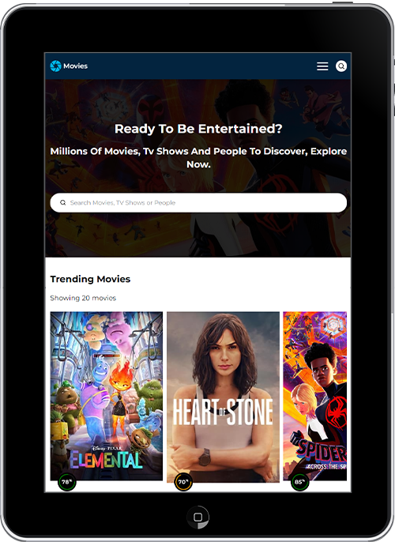

# Movies

On the lookout for your next binge-watch? This app pulls data from the TMDB API to help you explore millions of movies, TV shows, and popular personalities. Browse upcoming releases, rediscover old favourites, or stay up to date with the latest trends. With user-friendly filters and fast performance, finding what you're after is effortless — whether it's trailers, posters, reviews, cast info, or something unexpected. With this much variety, you’ll never run out of reasons to procrastinate.

## Design

A reimagined take on themoviedb.org, featuring a mix of obvious and subtle design changes that give it a more polished, user-focused feel. The layout is built to be responsive and intuitive across all screen sizes.

## Features

- Responsive layout and image optimisation
- Infinite scroll data loading
- Toggleable mobile navigation
- Custom SVG icons
- Full search functionality (Movies, TV shows, People)
- User-friendly filters and sort options
- Smooth client-side navigation
- Embedded video content from YouTube

### Movies

- Quick nav: Popular, Theatrical, Upcoming, Top Rated
- Sort by: Popularity, Rating, Revenue, Release Date
- Filter by: Region, Providers, Genres, Certifications, Release Dates, User Ratings, Votes, Adult Content
- Detailed views include: Posters, Backdrops, Certification, Genre, Release Date, Runtime, User Score, Overview, Crew, Cast, Budget, Revenue, Social Links, Reviews, Recommendations, Video Content, and Suggestions

### TV Shows

- Quick nav: Popular, Airing Today, Next 7 Days, Top Rated
- Sort and filter as with movies, plus: Air Dates, Seasons, Episodes
- Season and episode breakdowns with full metadata
- Video clips, trailers, bloopers, and more

### People

- Profile pages include: Bio, Known For, Filmography (Cast and Crew), Birth Details, Social Links, Images

## Project Focus

This was the first project where I worked with TypeScript in a real-world application. While there was a learning curve early on, it helped shape better development habits and a more structured approach to writing scalable React components. I also deepened my understanding of data fetching with React Query and handling complex, nested API responses.

## Core Technologies

- HTML5
- Sass(Scss)
- TypeScript
- React
- React query

## APIs

- [TMDB](https://developer.themoviedb.org/docs)
- Native Fetch
- Intersection Observer API

## Third party

- [YouTube](https://www.youtube.com/)
- [React icons](https://react-icons.github.io/react-icons)
- [React router](https://reactrouter.com/en/main)
- [React query](https://tanstack.com/query/latest/docs/react/overview)

## Design tools

- Adobe Photoshop
- Adobe Illustrator

## Live Site

[Movies](https://pux-movies.netlify.app/)
